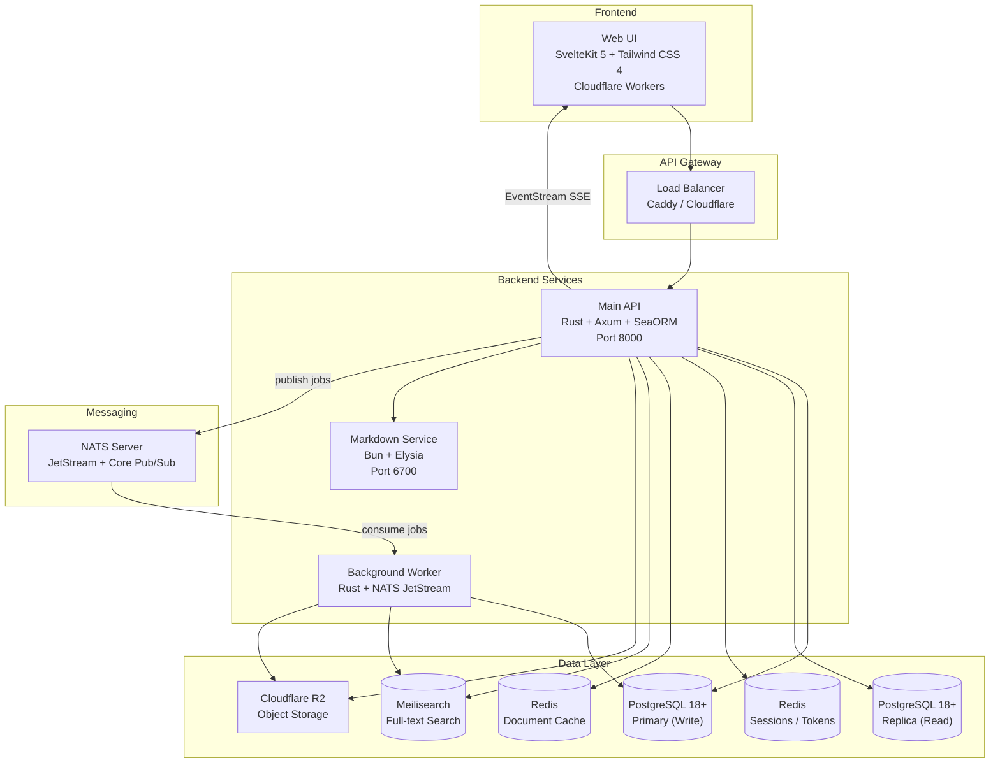
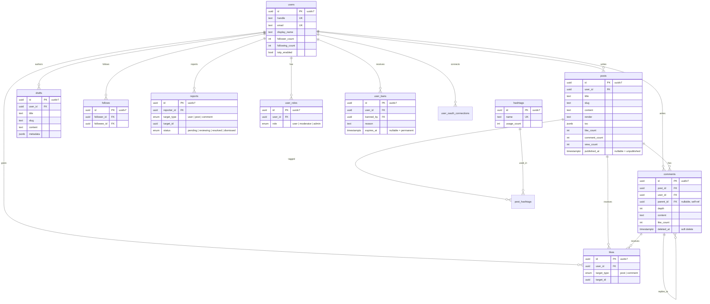

<div align="center">
  

  # Mofumofu

  **A soft and simple social blogging platform for everyone**

  *"Mofumofu" (もふもふ) - Japanese for something soft and fluffy*

  [](https://opensource.org/licenses/Apache-2.0)
  [](https://www.rust-lang.org/)
  [](https://svelte.dev)
  [](https://postgresql.org/)

</div>

---

## Architecture



| Component | Technology | Purpose |
|---|---|---|
| **Web UI** | SvelteKit 5, Tailwind CSS 4, shadcn-svelte | Frontend (Cloudflare Workers) |
| **Main API** | Rust, Axum, SeaORM, utoipa | REST API + OpenAPI docs |
| **Worker** | Rust, NATS JetStream | Background jobs |
| **Markdown Service** | Bun, Elysia, unified.js | Markdown rendering + TOC |
| **PostgreSQL 18+** | uuidv7 native | Write/read replica |
| **Redis** | 2 instances | Sessions (AOF) + cache (LRU) |
| **NATS** | JetStream + Pub/Sub | Job queue + EventStream |
| **Meilisearch** | Search engine | Full-text search |
| **Cloudflare R2** | S3-compatible | Image storage |

---

## Features

- **Auth**: Session-based with TOTP 2FA, OAuth (Google, GitHub, Discord, X, Microsoft), Cloudflare Turnstile
- **Content**: Markdown (GFM, KaTeX, syntax highlighting, emoji), drafts, threaded comments, hashtags
- **Social**: Follow/unfollow, like posts and comments, trending hashtags, cursor-based pagination
- **Media**: Profile/banner/post image uploads with WebP processing (R2)
- **Moderation**: Role hierarchy (User < Moderator < Admin), bans, report workflow, audit logs
- **Real-time**: EventStream via SSE (NATS Pub/Sub fan-out)

---

## Database Schema



---

## API

**Base URL**: `http://localhost:8000/v0` | **Swagger UI**: `http://localhost:8000/docs`

### Auth & OAuth

```http
POST   /auth/login                         # Email/password login
POST   /auth/logout                        # Logout
POST   /auth/verify-email                  # Email verification
POST   /auth/forgot-password               # Password reset request
POST   /auth/reset-password                # Reset password
POST   /auth/change-password               # Change password
POST   /auth/change-email                  # Change email

GET    /auth/totp/status                   # 2FA status
POST   /auth/totp/setup                    # Setup TOTP
POST   /auth/totp/enable                   # Enable TOTP
POST   /auth/totp/verify                   # Verify TOTP (2FA login)
POST   /auth/totp/disable                  # Disable TOTP

GET    /auth/oauth/{provider}/authorize    # OAuth authorization URL
POST   /auth/oauth/{provider}/login        # OAuth code exchange
POST   /auth/oauth/{provider}/link         # Link OAuth to account
GET    /auth/oauth/connections             # List connected providers
```

### Content

```http
POST   /posts                              # Create post
GET    /posts                              # List posts
GET    /posts/{post_id}                    # Get post
PATCH  /posts/{post_id}                    # Update post
DELETE /posts/{post_id}                    # Delete post
POST   /posts/{post_id}/view              # Increment view count
POST   /posts/images                       # Upload post image

POST   /drafts                             # Create draft
GET    /drafts                             # List drafts
GET    /drafts/{draft_id}                  # Get draft
PATCH  /drafts/{draft_id}                  # Update draft
DELETE /drafts/{draft_id}                  # Delete draft
POST   /drafts/{draft_id}/publish          # Publish draft as post

POST   /comments                           # Create comment
GET    /comments                           # List comments
PATCH  /comments/{comment_id}              # Update comment
DELETE /comments/{comment_id}              # Delete comment
```

### Social

```http
POST   /likes                              # Like (post or comment)
DELETE /likes                              # Unlike
GET    /likes/status                       # Check like status

POST   /follows                            # Follow user
DELETE /follows                            # Unfollow user
GET    /follows/status                     # Check follow status

GET    /hashtags/trending                  # Trending hashtags
```

### Users

```http
POST   /users                              # Create user
GET    /users/profile                      # Get profile (by handle)
GET    /user/me                            # My profile
PATCH  /user/me                            # Update my profile
POST   /user/me/profile-image             # Upload profile image
POST   /user/me/banner-image              # Upload banner image
```

### Moderation

```http
POST   /reports                            # Create report
GET    /reports                            # List reports
PATCH  /reports/{report_id}                # Update report status
POST   /users/roles/grant                  # Grant role
POST   /users/roles/revoke                 # Revoke role
POST   /users/ban                          # Ban user
POST   /users/unban                        # Unban user
GET    /moderation-logs                    # Moderation logs
GET    /action-logs                        # Action logs
GET    /eventstream/actions                # SSE event stream
```

---

## Quick Start

```bash
# Backend
cd mofumofu-server
cp .env.example .env
cd crates/migration && cargo run        # Run migrations
cargo run -p mofumofu-server            # Start API
cargo run -p mofumofu-worker            # Start worker
cd markdown-service && bun install && bun run dev  # Start markdown service

# Frontend
cd mofumofu-ui
pnpm install && pnpm dev
```

**Web UI**: http://localhost:5173 | **API Docs**: http://localhost:8000/docs

---

## License

Apache License 2.0 - See [LICENSE](./LICENSE)

---

<div align="center">

_We believe the internet should be a space for genuine thought and expression._
_Mofumofu doesn't optimize for engagement metrics or algorithmic reach._
_It's built for clarity, ownership, and simplicity._

**Made with love by levish (Levi Lim) & Community**

</div>
